# AWS Deployment Architecture

## Overview

This document describes the complete AWS infrastructure for the Voice Workout Tracker (Titan Trakr), replicating your successful PassportPhotoFactory architecture with PostgreSQL instead of DynamoDB.

---

## High-Level Architecture

```mermaid
graph TB
    User[👤 User Browser]
    
    subgraph DNS["Route53 DNS"]
        D1[titantrakr.com]
        D2[traktitan.com]
        D3[tritontracker.com]
        D4[staging.titantrakr.com]
    end
    
    subgraph CDN["CloudFront CDN"]
        CF[CloudFront Distribution<br/>SSL: ACM Certificate<br/>Cache: Static Assets]
    end
    
    subgraph Compute["AWS Lambda"]
        L[Lambda Function<br/>Docker Image<br/>FastAPI + Mangum<br/>512 MB, 30s timeout]
        URL[Function URL<br/>Public HTTPS]
    end
    
    subgraph Database["Database Layer"]
        Proxy[RDS Proxy<br/>Connection Pooling]
        DB[(RDS PostgreSQL<br/>db.t4g.micro<br/>20 GB gp3)]
    end
    
    subgraph Backup["Backup & DR"]
        Snap[RDS Automated<br/>Snapshots<br/>30-day PITR]
        Vault[AWS Backup Vault<br/>Daily/Weekly/Monthly]
    end
    
    User -->|HTTPS| DNS
    DNS -->|Alias| CF
    CF -->|Cache Miss| URL
    URL -->|Invoke| L
    L -->|PostgreSQL| Proxy
    Proxy -->|Connection Pool| DB
    DB -.->|Automated| Snap
    DB -.->|Scheduled| Vault
    
    style User fill:#4CAF50
    style CF fill:#FF9800
    style L fill:#2196F3
    style DB fill:#9C27B0
    style Vault fill:#F44336
```



---

## Network Architecture (VPC)


**Note:** Lambda is in VPC to reach RDS, but can still access internet for LLM APIs (via NAT Gateway or VPC endpoints).

---

## Request Flow (User Logs a Set)

```mermaid
sequenceDiagram
    participant U as User<br/>(Browser)
    participant CF as CloudFront
    participant L as Lambda<br/>(FastAPI)
    participant P as RDS Proxy
    participant DB as PostgreSQL
    participant LLM as Anthropic<br/>Claude API
    
    U->>CF: POST /api/voice/process<br/>{"transcript": "80kg for 10"}
    
    alt Cache Miss
        CF->>L: Forward to Lambda URL
    end
    
    L->>LLM: Process voice command
    LLM-->>L: {"action": "emit", "exercise_id": "bench-press"}
    
    L->>P: BEGIN TRANSACTION
    P->>DB: Get current_workout projection
    DB-->>P: {id: "abc", exercises: [...]}
    P-->>L: Projection data
    
    L->>L: Validate preconditions
    
    L->>P: INSERT INTO events (...)
    P->>DB: Write event
    L->>P: UPDATE projections SET data = ...
    P->>DB: Update projection
    L->>P: COMMIT
    
    P-->>L: Transaction success
    L-->>CF: 200 OK {success: true}
    CF-->>U: Response (cached if GET)
    
    U->>U: Display "Logged 80kg × 10"
```



---

## Data Storage Architecture


### Table Schemas

#### Events Table (Append-Only)
```sql
CREATE TABLE events (
    id SERIAL PRIMARY KEY,
    event_id UUID UNIQUE NOT NULL,
    timestamp TIMESTAMPTZ NOT NULL,
    event_type VARCHAR(50) NOT NULL,
    payload JSONB NOT NULL,
    schema_version INTEGER DEFAULT 1
);

CREATE INDEX idx_events_type ON events(event_type);
CREATE INDEX idx_events_timestamp ON events(timestamp);
```

#### Projections Table (Derived State)
```sql
CREATE TABLE projections (
    key VARCHAR(255) PRIMARY KEY,
    data JSONB NOT NULL,
    updated_at TIMESTAMPTZ NOT NULL
);
```

---

## Component Architecture

```mermaid
graph TB
    subgraph Client["Client Layer"]
        Browser[Web Browser<br/>Alpine.js + Tailwind]
        Voice[Web Speech API<br/>STT + TTS]
    end
    
    subgraph Application["Application Layer"]
        FastAPI[FastAPI Application]
        
        subgraph Routes["API Routes"]
            R1[/api/events]
            R2[/api/voice]
            R3[/api/history]
            R4[/api/templates]
        end
        
        subgraph Core["Business Logic"]
            EventHandler[Event Handler<br/>Validation]
            Projections[Projection Builder]
            VoiceProcessor[Voice Command<br/>LLM Processing]
        end
        
        subgraph Data["Data Layer"]
            DBAdapter[Database Adapter<br/>SQLite ↔ PostgreSQL]
        end
    end
    
    subgraph External["External Services"]
        Claude[Anthropic Claude<br/>3.5 Haiku]
        OpenAI[OpenAI GPT-4<br/>Optional]
    end
    
    Browser -->|REST API| FastAPI
    Voice -->|Transcript| R2
    
    FastAPI --> R1
    FastAPI --> R2
    FastAPI --> R3
    FastAPI --> R4
    
    R1 --> EventHandler
    R2 --> VoiceProcessor
    VoiceProcessor --> Claude
    VoiceProcessor --> OpenAI
    
    EventHandler --> Projections
    EventHandler --> DBAdapter
    Projections --> DBAdapter
    
    style FastAPI fill:#4CAF50
    style Claude fill:#FF9800
    style DBAdapter fill:#2196F3
```

---

## Backup & Disaster Recovery Architecture


---

## Multi-Environment Setup


---

## Deployment Pipeline


---

## Request Flow (Detailed)

```mermaid
sequenceDiagram
    autonumber
    
    participant User as 👤 User
    participant DNS as Route53<br/>DNS
    participant CF as CloudFront<br/>CDN
    participant Lambda as AWS Lambda<br/>FastAPI
    participant Proxy as RDS Proxy
    participant DB as PostgreSQL
    participant Claude as Anthropic<br/>Claude API
    
    User->>DNS: https://titantrakr.com
    DNS-->>User: CNAME → CloudFront
    
    User->>CF: GET /
    
    alt Static Asset (Cached)
        CF-->>User: index.html (from cache)
    else Cache Miss
        CF->>Lambda: Invoke Function URL
        Lambda-->>CF: Serve frontend/index.html
        CF-->>User: HTML (cache for 5 min)
    end
    
    Note over User: User taps mic, says<br/>"bench press 100 for 8"
    
    User->>CF: POST /api/voice/process
    CF->>Lambda: Forward (no cache for /api/*)
    
    Lambda->>Claude: Process transcript<br/>+ workout context
    Claude-->>Lambda: Exercise: bench-press<br/>Weight: 100kg, Reps: 8
    
    Lambda->>Proxy: BEGIN TRANSACTION
    Proxy->>DB: SELECT data FROM projections<br/>WHERE key='current_workout'
    DB-->>Lambda: Current workout state
    
    Lambda->>Lambda: validate_preconditions()<br/>Check workout active
    
    Lambda->>Proxy: INSERT INTO events (...)
    Lambda->>Proxy: UPDATE projections SET data = ...
    Lambda->>Proxy: COMMIT
    
    Proxy->>DB: Execute transaction
    DB-->>Proxy: Success
    Proxy-->>Lambda: Committed
    
    Lambda-->>CF: 200 OK {success: true,<br/>message: "Logged 100kg × 8"}
    CF-->>User: JSON response
    
    Note over User: Display success<br/>Speak confirmation
```



---

## CloudFormation Stack Resources


**Total Resources:** ~31 AWS resources created by one CloudFormation template

---

## Security Architecture


### Security Features

| Layer | Security Measure |
|-------|------------------|
| **Transport** | TLS 1.2+ (CloudFront to user) |
| **Application** | JWT tokens (future auth) |
| **Network** | Security groups (least privilege) |
| **Database** | Private subnet, no public IP |
| **Data at rest** | RDS encryption, KMS keys |
| **Credentials** | Secrets Manager (not env vars) |
| **Backups** | KMS encrypted vault |

---

## Cost Architecture (Monthly)


### Cost Breakdown Table

| Tier | Component | Staging | Production | Notes |
|------|-----------|---------|------------|-------|
| **Always On** | RDS db.t4g.micro | $5 | $12 | Stop staging off-hours |
| **Always On** | RDS Proxy | $0 | $11 | Staging direct connect |
| **Always On** | Route53 (3 zones) | Shared | $1.50 | Shared cost |
| **Usage-Based** | Lambda | $0 | $0 | Within free tier (1M requests) |
| **Usage-Based** | CloudFront | $1 | $5 | Data transfer + requests |
| **Usage-Based** | AWS Backup | $0 | $2 | Storage only |
| **Usage-Based** | LLM APIs | ~$5 | ~$30 | Voice command processing |
| **Total** | | **$6-11** | **$31.50-61.50** | Depends on usage |

---

## Scaling Path


---

## Infrastructure Components Summary

### Core Services (7)

1. **Route53** - DNS management for 3 domains
2. **ACM** - SSL certificates (free)
3. **CloudFront** - Global CDN (150+ edge locations)
4. **Lambda** - Serverless compute (FastAPI + Mangum)
5. **RDS PostgreSQL** - Relational database
6. **RDS Proxy** - Connection pooling
7. **AWS Backup** - Advanced backup management

### Supporting Services (4)

8. **VPC** - Network isolation for database
9. **Secrets Manager** - Database credentials
10. **IAM Roles** - Least-privilege access
11. **CloudWatch** - Logs and metrics

### Optional Services (3)

12. **SES** - Email (if you add notifications)
13. **S3** - Long-term archives (optional)
14. **EventBridge** - Scheduled tasks (DB start/stop)

---

## Comparison: PassportPhotoFactory vs Gym App


### Key Similarities

- ✅ CloudFront → Lambda Function URL pattern
- ✅ FastAPI serves both frontend and API
- ✅ Docker-based Lambda (easier deployment)
- ✅ No API Gateway (simpler, cheaper)
- ✅ Route53 + ACM for custom domains
- ✅ Serverless compute (Lambda scales automatically)

### Key Differences

| Aspect | PFF | Gym App |
|--------|-----|---------|
| **Database** | DynamoDB (NoSQL) | RDS PostgreSQL (SQL) |
| **VPC** | No | Yes (for RDS) |
| **Connection Pooling** | N/A | RDS Proxy |
| **Backup** | DynamoDB PITR | RDS + AWS Backup |
| **Storage** | S3 (photos) | None (no files) |
| **Async Jobs** | SQS + Lambda | None yet |
| **Email** | SES | None yet |

---

## Event-Sourcing Pattern on AWS

```mermaid
graph TB
    subgraph Events["Event Store (Immutable)"]
        E1[WorkoutStarted<br/>timestamp: 2024-01-01T10:00:00Z]
        E2[ExerciseAdded<br/>timestamp: 2024-01-01T10:01:00Z]
        E3[SetLogged<br/>timestamp: 2024-01-01T10:05:00Z]
        E4[SetLogged<br/>timestamp: 2024-01-01T10:08:00Z]
        E5[WorkoutCompleted<br/>timestamp: 2024-01-01T11:00:00Z]
    end
    
    subgraph Projections["Projections (Derived State)"]
        P1[current_workout<br/>Null]
        P2[workout_history<br/>[{...workout data...}]]
        P3[exercise_history:bench-press<br/>{last_weight: 80kg}]
        P4[personal_records:bench-press<br/>{max_weight: 100kg}]
    end
    
    subgraph Storage["PostgreSQL Storage"]
        Events -->|events table<br/>JSONB payload| PG[(PostgreSQL)]
        Projections -->|projections table<br/>JSONB data| PG
    end
    
    E1 -.->|Build| P1
    E2 -.->|Build| P1
    E3 -.->|Build| P1
    E4 -.->|Build| P1
    E5 -.->|Build| P2
    E5 -.->|Clear| P1
    E3 -.->|Update| P3
    E4 -.->|Update| P3
    E4 -.->|Check PR| P4
    
    style Events fill:#4CAF50
    style Projections fill:#2196F3
    style PG fill:#9C27B0
```

**Why This Works on PostgreSQL:**
- ✅ JSONB columns for flexible event payloads
- ✅ ACID transactions (validate → write → update atomically)
- ✅ Indexes on timestamp and event_type
- ✅ Your `IMMEDIATE` isolation level prevents race conditions

---

## Deployment States


---

## Monitoring & Observability

```mermaid
graph TB
    subgraph Sources["Data Sources"]
        L[Lambda Logs<br/>CloudWatch Logs]
        DB[RDS Metrics<br/>CPU, Connections, IOPS]
        CF[CloudFront Metrics<br/>Requests, Errors, Latency]
        Backup[Backup Jobs<br/>Success/Failure]
    end
    
    subgraph Processing["Processing"]
        CW[CloudWatch<br/>Metrics & Logs]
        Alarms[CloudWatch Alarms]
    end
    
    subgraph Notifications["Notifications"]
        SNS[SNS Topic<br/>gym-app-alerts]
        Email[📧 Email]
        SMS[📱 SMS Optional]
        Slack[💬 Slack Webhook]
    end
    
    subgraph Dashboards["Dashboards"]
        D1[CloudWatch Dashboard<br/>Real-time metrics]
        D2[Cost Explorer<br/>Spending trends]
        D3[RDS Performance Insights<br/>Query analysis]
    end
    
    L --> CW
    DB --> CW
    CF --> CW
    Backup --> CW
    
    CW --> Alarms
    Alarms -->|Trigger| SNS
    SNS --> Email
    SNS --> SMS
    SNS --> Slack
    
    CW --> D1
    DB --> D3
    
    style Alarms fill:#F44336,color:#fff
    style SNS fill:#FF9800
    style D1 fill:#2196F3,color:#fff
```



---

## Key Metrics to Monitor

### Application Health

- Lambda invocations per minute
- Lambda errors (4xx, 5xx)
- Lambda duration (p50, p95, p99)
- Lambda cold start rate
- Voice processing success rate

### Database Health

- RDS CPU utilization
- RDS freeable memory
- RDS database connections (should be < 100)
- RDS read/write IOPS
- RDS Proxy connections (pool efficiency)

### CDN Performance

- CloudFront cache hit ratio (target: >80%)
- CloudFront origin latency
- CloudFront 4xx/5xx error rate
- CloudFront data transfer (cost tracking)

### Backup Integrity

- Backup job success rate (target: 100%)
- Backup storage used (growth trend)
- Backup restore test results (monthly)

---

## Architecture Decisions Rationale

### Why Lambda (not EC2/ECS)?
- ✅ Serverless = zero maintenance
- ✅ Auto-scaling (0 to thousands of concurrent users)
- ✅ Pay per request (not idle time)
- ✅ Matches your proven PFF pattern

### Why RDS Proxy?
- ✅ Lambda creates new DB connections per invocation
- ✅ Without proxy: connection exhaustion at scale
- ✅ With proxy: connection pooling + reuse
- ✅ Production-grade best practice

### Why PostgreSQL (not DynamoDB like PFF)?
- ✅ Full SQL support (complex queries, JOINs)
- ✅ JSONB for flexible event payloads
- ✅ ACID transactions (your event-sourcing needs this)
- ✅ Easier migration from SQLite (minimal code changes)
- ✅ Better for relational data (users, workouts, exercises)

### Why VPC (PFF doesn't use it)?
- ✅ RDS requires VPC (private subnets)
- ✅ Database not exposed to public internet
- ✅ Security best practice
- ⚠️ Adds complexity (NAT Gateway for internet access)

### Why Docker Image (not ZIP)?
- ✅ Easier dependency management (psycopg2 compiled binaries)
- ✅ Consistent builds (local = prod)
- ✅ Faster deployments (layer caching)
- ✅ Matches your PFF pattern

---

## Summary

You now have a **production-ready, serverless, multi-environment AWS architecture** that:

1. ✅ Replicates your PassportPhotoFactory pattern
2. ✅ Uses PostgreSQL (your preference over DynamoDB)
3. ✅ Supports staging + production environments
4. ✅ Includes comprehensive 3-tier backup strategy
5. ✅ Handles SSL for 3 domains automatically
6. ✅ Scales automatically with Lambda
7. ✅ Costs ~$40/month for both environments
8. ✅ One-command deployment scripts
9. ✅ Complete monitoring and alerting
10. ✅ Disaster recovery capabilities

**Total Infrastructure: 31 AWS resources, managed by CloudFormation**

Deploy with:
```bash
./infrastructure/scripts/deploy.sh staging
./infrastructure/scripts/deploy.sh prod
```


